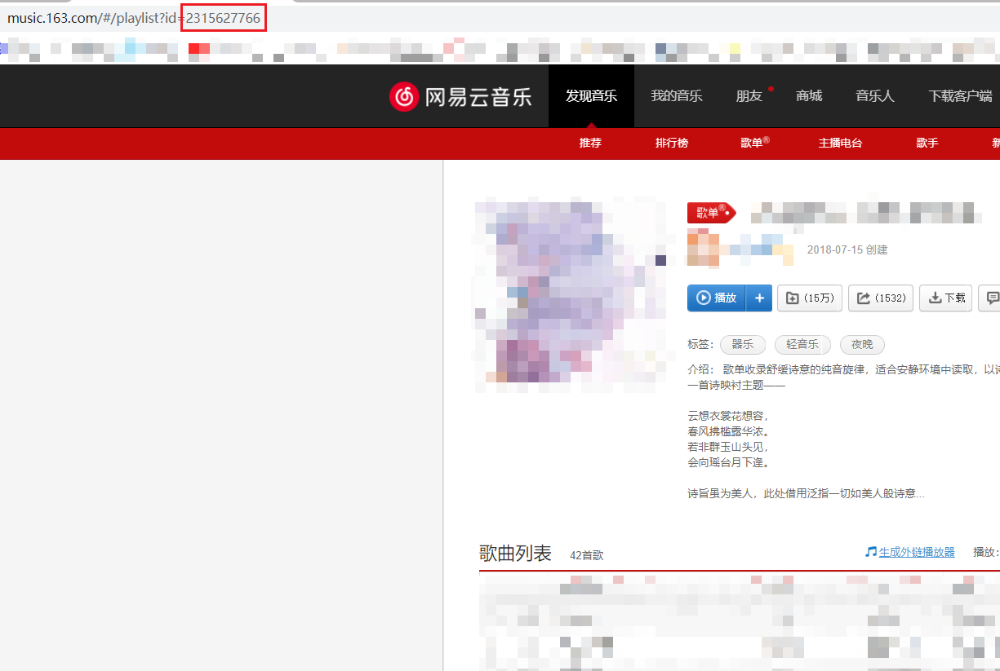

# ncmlu

NCM 任务执行脚本，Go 版本。


## Implements

- ✅ 登录
- ✅ 签到
- ✅ 获取推荐歌单
- ✅ 获取歌单内所有歌曲
- ✅ 刷播放量
- ✅ 日志文件
- ✅ 间隔执行
- ✅ 自定义歌单
- 路由

## Usage

1. 跳转 [Release](https://github.com/secriy/ncmlu/releases) 页面下载对应操作系统的压缩包，如 Windows 环境下载 ncmlu_xxx_Windows_x86_64.tar.gz
2. 解压压缩包，得到可执行文件，如 Windows 下的*ncmlu.exe*文件
3. 创建配置文件*config.yaml*
4. 将可执行文件（如*ncmlu.exe*）与*config.yaml*文件放在同一目录下
5. 按如下方式配置*config.yaml*文件，注意空格和缩进：

   单账号：

   ```
   accounts:
     - phone: 1111111111 	# 修改为账号的手机号
       passwd: 'xxxxxxxxx'	# 修改为对应的密码，为防止解析错误，建议使用半角引号包裹；密码支持 32 位小写 MD5 格式，同样支持明文
       expired: 2021-09-05	# 到期时间，如设置为2021-09-05则当天及之后不会再执行该账号的任务
       only_sign: false	# 是否只执行签到，设置为true则仅执行签到任务
   ```

   多账号（规则与单账号相同）：

   ```
   accounts:
     - phone: 1111111111
       passwd: 'xxxxxxxxx'
       expired: 2021-09-05
       only_sign: false
     - phone: 1111111111
       passwd: 'xxxxxxxxx'
       expired: 2021-09-05
       only_sign: false
     - phone: 1111111111
       passwd: 'xxxxxxxxx'
       expired: 2021-09-05
       only_sign: false
     - phone: 1111111111
       passwd: 'xxxxxxxxx'
       expired: 2021-09-05
       only_sign: false
   ```

6. 双击可执行文件（如*ncmlu.exe*）执行脚本
7. 查看当前目录下的新文件*ncmlu.log*，可以得到输出结果

### 自定义歌单

注意：使用自定义歌单时，不会获取每日的推荐歌单刷歌，如需取消自定义歌单，删除或注释增加的**playlist**字段即可。

将*config.yaml*配置文件修改为如下格式，多账号同理：

```
playlist:
  - 4234112
  - 4312424
accounts:
  - phone: 1342412432
    passwd: "xxxxxx"
    expired: 2022-09-06
    only_sign: false
```

**playlist**列表填写需要使用的歌单 ID，可指定单个或多个，可以通过下图方式获得：



## Deployment

### Linux 服务器部署

1. 从 [Release](https://github.com/secriy/ncmlu/releases) 页面下载*ncmlu_xxx_Linux_x86_64.tar.gz*压缩包，
2. 将 tar.gz 压缩包中的*ncmlu*可执行文件提取至服务器某一目录，再将项目中的*config.yaml*文件复制到同一目录（也可手动创建文件）
3. 按照前文所述规则填写*config.yaml*文件配置
4. 在同一目录下创建*run.sh*文件，填写如下内容：

   ```sh
   # 这里的 /path_to 需要改为ncmlu文件所在的目录的绝对路径
   cd /path_to
   ./ncmlu
   ```

   如：

   ```sh
   # 该路径仅为举例，请勿直接用于自己的服务器
   cd /home/secriy/task
   ./ncmlu
   ```

5. 输入命令`crontab -e`，在打开的编辑器中填写一行内容（/path_to 同样需要更改）：

   ```
   0 2 * * * bash /path_to/run.sh
   ```

   其中，`0 2 * * *`表示每天的凌晨 2 点 0 分执行，如有需要可以修改，例如：

   ```
   30 5 * * * bash /home/secriy/task/run.sh
   ```

   即每天的 5 点 30 分执行。

6. 保存修改

### Linux 下宝塔面板部署

如果有宝塔面板，首先按照上一条**Linux 服务器部署**的前四步操作，最后在宝塔面板的定时任务里创建一个定时任务，执行的指令填写`bash /path_to/run.sh`。
